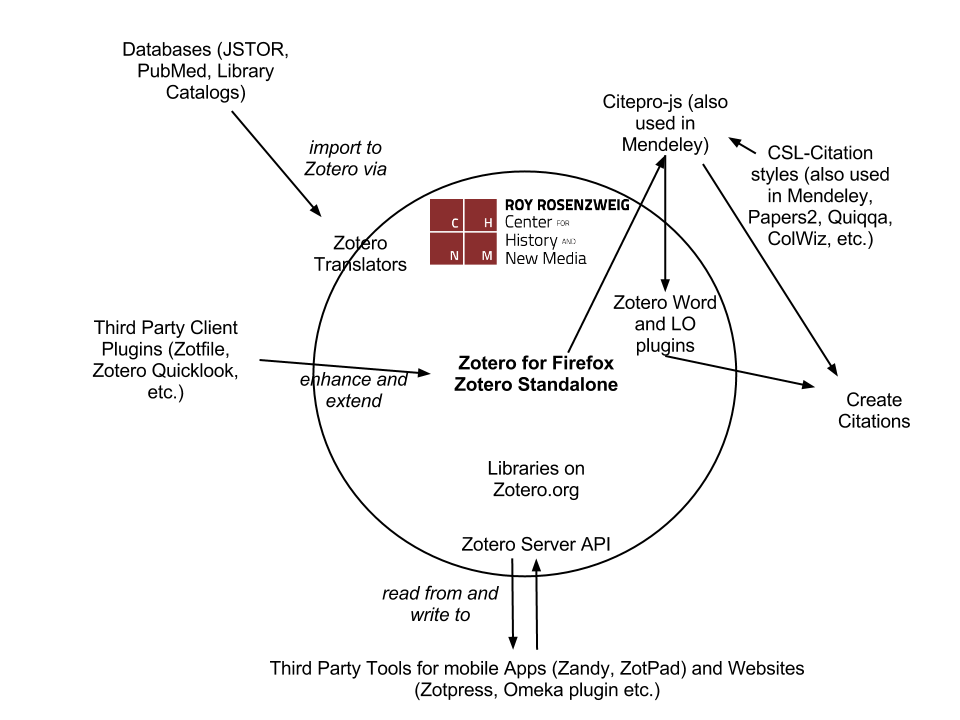

% The Zotero Universe
% Sebastian Karcher
% Boston College, November 2012

# The Zotero Universe
* Zotero is made up of many parts
* Many of them are housed as the CHNM at George Mason University
* But many others are not
* It is useful to understand how these components work together

#The Zotero Universe - A Map
 

# Extending the Zotero Universe - Zotero Plugins

* All plugins are at: http://www.zotero.org/support/plugins
* Zotero Quicklook - Previews for Zotero
* Zotfile - advanced PDF handling for Zotero
* Qnotero - quick access to Zotero from the taskbar
* Papermachines - Textmining and display with Zotero

# Beyond Zotero - Multilingual Zotero (MLZ)

* www.citationstylist.org
* "Fork" of Zotero by Frank Bennett
* Closely aligned with regular Zotero
* Particularly for legal citations and non-Western languages
* Experimental/Cutting Edge
